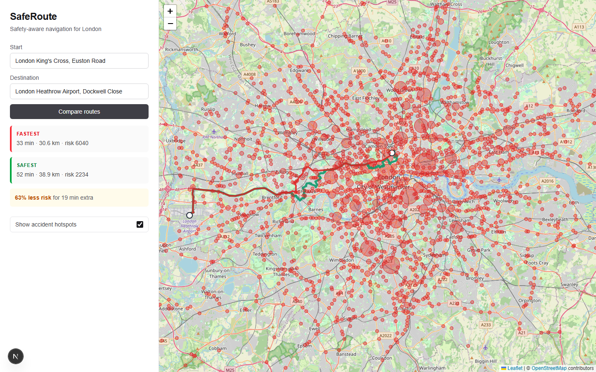
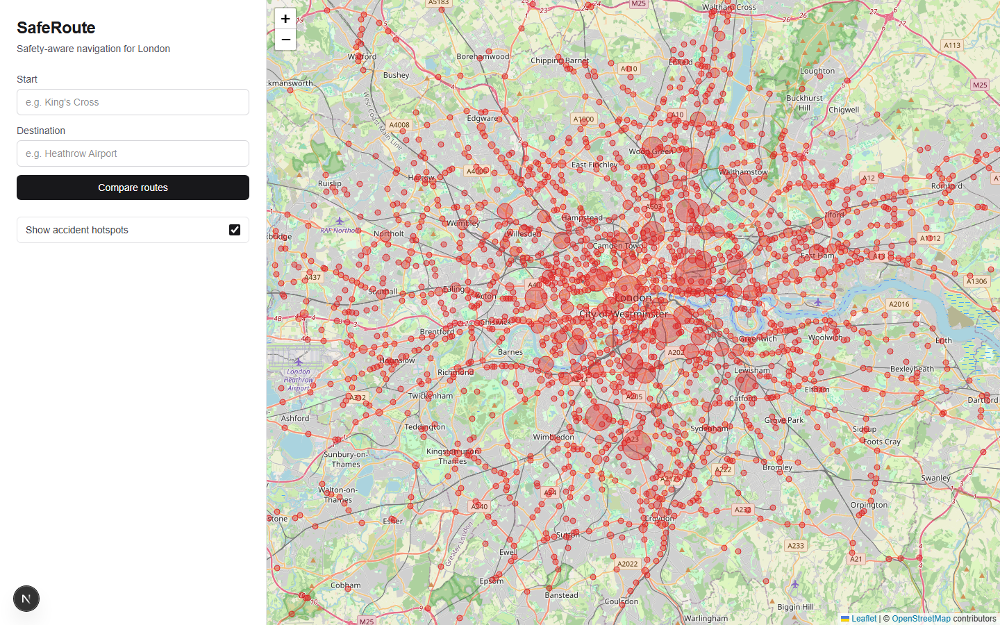
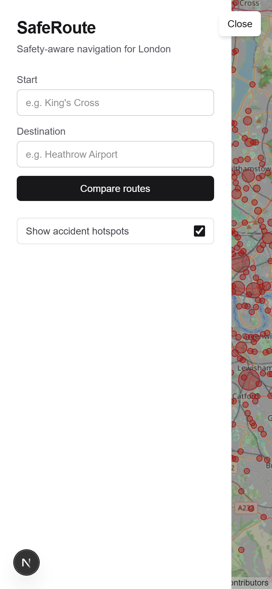

# SafeRoute


Safety-aware navigation for London. SafeRoute uses 5 years of UK STATS19 collision data and three machine-learning steps to recommend driving routes that balance speed against historical accident risk — showing the fastest and the safest route side by side, with a quantified trade-off.



## What it does

- Pick a start and destination (with address autocomplete) and get **two routes**: fastest (red) and safest (green).
- See the trade-off in plain numbers — e.g. *"62% less risk for 19 minutes extra."*
- Toggle a layer of **accident hotspots** (DBSCAN clusters) over the map.
- Fully responsive — works on desktop and mobile.

| Hotspots over London | Mobile |
| --- | --- |
|  |  |

## How it works

Data flows from raw public datasets through an ML pipeline into a routing API and a map UI:

1. **Data** — STATS19 collisions + DfT AADT traffic counts, cleaned and filtered to a London bounding box, stored in Parquet and PostGIS.
2. **DBSCAN clustering** — groups collisions into accident hotspots.
3. **Risk scoring** — each road segment scored as `(collision_count × severity) ÷ traffic_volume`, normalized 0–100.
4. **Random Forest** — predicts a severity distribution from time/weather context, turned into a risk multiplier.
5. **Modified Dijkstra** — edge weight `α × travel_time + (1−α) × risk_score × multiplier`; `α=1.0` is fastest, `α=0.3` is safest.
6. **FastAPI + Next.js/Leaflet** — serve and render it.

### Key numbers

- 503k UK collisions → **123,576** London rows
- **4,416** DfT AADT count points (London)
- Road graph: **165,716** nodes / **381,109** edges
- **1,863** DBSCAN hotspots
- **64,652** risk-scored road segments (13% AADT fallback)
- Random Forest: 200 trees, severity-by-context, baseline-normalized multiplier

## API

Served at `http://localhost:8000` (interactive docs at `/docs`):

| Endpoint | Purpose |
| --- | --- |
| `GET /health` | liveness check |
| `GET /api/hotspots?bounds=s,w,n,e` | hotspots within a bounding box |
| `GET /api/route?origin=lat,lng&dest=lat,lng&when=ISO&weather=int` | fastest + safest routes with comparison |
| `GET /api/risk?u=&v=&key=&when=&weather=` | risk score for one road segment |
| `GET /api/temporal?lat=&lng=&when=&weather=` | 24-hour risk profile for a location |

## Stack

- **Backend**: Python 3.10+, FastAPI, SQLAlchemy + GeoAlchemy2
- **Database**: PostgreSQL + PostGIS
- **ML / data**: scikit-learn (DBSCAN, Random Forest), NetworkX, OSMnx, pandas
- **Frontend**: Next.js (App Router), React, Leaflet, Tailwind
- **Geocoding**: Nominatim (OpenStreetMap), London-biased

## Setup

1. **Postgres + PostGIS** on `localhost:5432` (native install or `docker compose up`). Database `saferoute` with the PostGIS extension; user `saferoute` / password `saferoute`.
2. **Backend**:
   ```
   cd backend
   python -m venv .venv
   .venv/Scripts/pip install -r requirements.txt        # Windows
   # source .venv/bin/activate && pip install -r requirements.txt   # macOS/Linux
   ```
3. **Build the data + models** (one-time, downloads ~300 MB of raw CSVs):
   ```
   .venv/Scripts/python ../scripts/download_stats19.py
   .venv/Scripts/python ../scripts/download_aadt.py
   .venv/Scripts/python -m app.data.preprocessing
   .venv/Scripts/python -m scripts.init_db
   .venv/Scripts/python -m scripts.load_to_db
   .venv/Scripts/python -m scripts.build_graph
   .venv/Scripts/python -m scripts.build_hotspots
   .venv/Scripts/python -m scripts.build_risk_scores
   .venv/Scripts/python -m scripts.train_temporal
   ```
4. **API**: `.venv/Scripts/python -m uvicorn app.main:app --reload` (cold start ~25s while it loads the graph, risk scores, and model). Visit `localhost:8000/health`.
5. **Frontend**: `cd frontend && npm install && npm run dev`, then open `localhost:3000`.

## Tests

```
cd backend
.venv/Scripts/python -m pytest
```

68 tests covering loaders, preprocessing, clustering, graph caching, risk scoring, the temporal model, and the API endpoints. Frontend is type-checked and linted via `npm run build` / `npm run lint`. CI runs both on every push.

## Data sources

- [STATS19 road safety data](https://www.data.gov.uk/dataset/cb7ae6f0-4be6-4935-9277-47e5ce24a11f/road-safety-data) — UK collisions, 2020–2024
- [DfT road traffic counts (AADT)](https://roadtraffic.dft.gov.uk/) — annual average daily flow

## Notes & limitations

- London only (the architecture generalizes to any UK city; the bounding box and data are the only city-specific pieces).
- The temporal multiplier is applied uniformly per route, so time-of-day shifts overall risk but not the chosen road — a documented simplification.
- Risk uses historical data; it doesn't capture road changes or real-time conditions.
